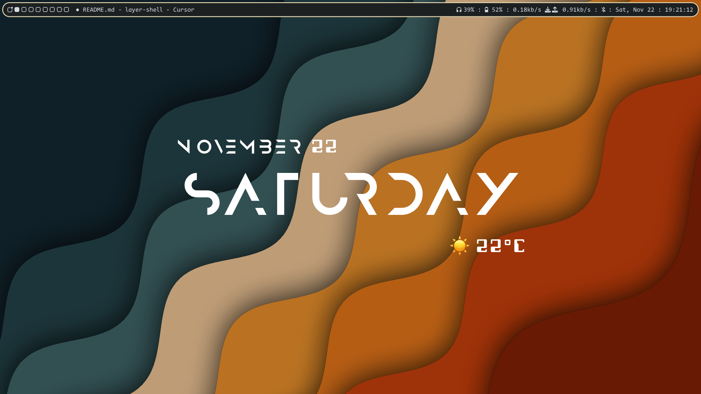

# desktop-thingy



It draws a bar, desktop background and a dashboard with day, date and weather

- Uses `GTK4` and `gtk4-layer-shell`

## Requirements

- GTK4
- gtk4-layer-shell (development headers)
- GCC (or compatible C compiler)
- pkg-config

## Building

Clone the repository and run:

```sh
make
```

To install the binary to `/usr/local/bin/` (requires appropriate permissions):

```sh
sudo make install
```

To clean up build artifacts:

```sh
make clean
```

## Usage

Once built, run:

```sh
./desktop-thingy
```

Or, if installed:

```sh
desktop-thingy
```

## Notes

- Ensure your compositor supports layer shell protocols.

## License

[MIT](LICENSE) or see the repository for licensing details.

